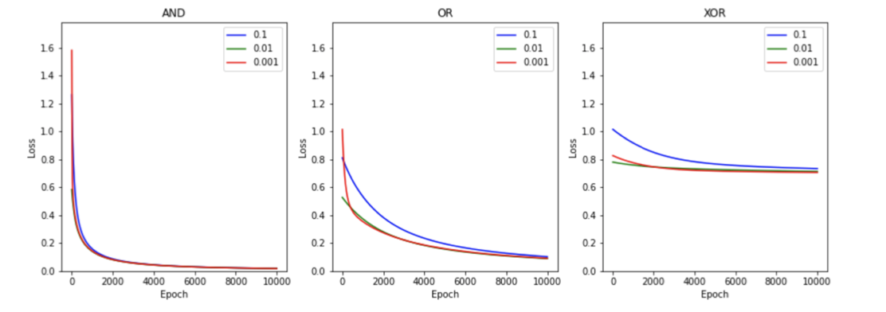
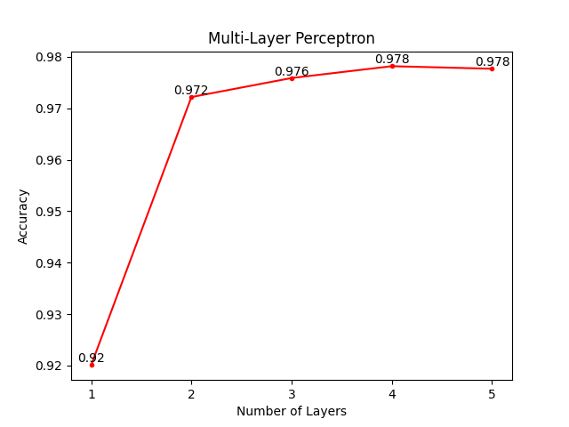

# Assignments

1. [Modeling AND, OR, XOR with Logistic Regression](./assignment2.py)

2. [Modeling XOR with Shallow Neural Network](./assignment3.py)
3. [Modeling Image Classifier with Multi Layer Perceptron](./assignment5.py)
